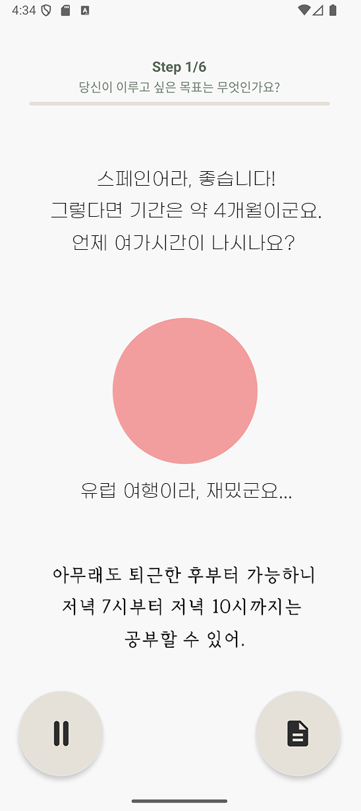
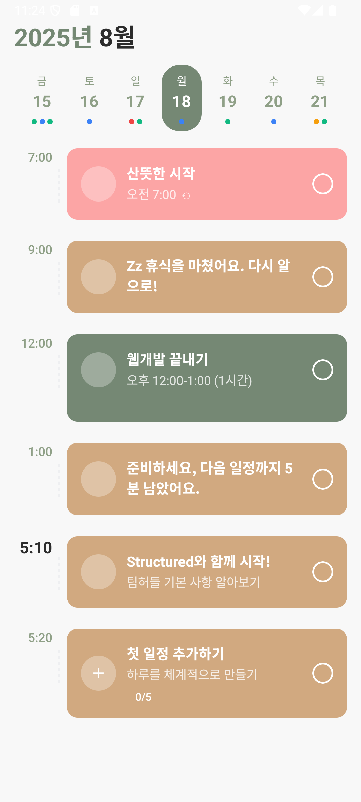

# Rooty (루티) 


## 1. 프로젝트 소개

### 1.1. 개발배경 및 필요성

자기계발을 위한 목표관리 앱은 이미 시장에 다양하게 존재하지만, 대부분은 기능 중심의 루틴 체크와 정량적 통계 제공에 그칩니다. 그러나 실제 사용자들은 일정 체크나 통계만으로는 실행력을 유지하기 어렵고, 특히 개인이 혼자 목표를 세우고 이를 실천하려고 할 때, 정서적 피드백이나 사회적 감시 요소가 부재한 상황에서는 지속적인 동기 유지를 기대하기 어렵다는 문제가 있습니다.

많은 사람들이 도서관, 카페, 강의실처럼 "다른 사람이 나를 보고 있는 환경"에서 더 잘 집중하고 목표하는 습관을 더 잘 실천하는 경험을 합니다. 이러한 환경은 단순히 공간의 문제가 아니라, “나를 지켜봐주는 존재가 있다”는 심리적 자극이 행동 지속에 실질적인 영향을 준다는 점을 보여줍니다.

이러한 인식을 바탕으로, AI가 감정적으로 반응하며 일상을 함께 조율해주는 코치로 작동한다면, 기존 루틴 앱보다 훨씬 높은 실행률과 몰입을 유도할 수 있을 것이라는 기대를 갖고 본 아이템을 기획하게 되었습니다.

### 1.2. 개발 목표 및 주요 내용

**주요 목표:**
- 사용자의 높은 수준의 목표를 AI가 지능적으로 분해하여 실행 가능한 세부 계획으로 변환
- 개인의 특성과 가용 시간을 고려한 맞춤형 루틴 자동 생성
- 실시간 음성 대화를 통한 자연스러운 목표 설정 및 피드백 시스템

**주요 내용:**
1. **지능형 목표 분해 시스템**: Google Gemini AI를 활용하여 복잡한 목표를 단계별 실행 계획으로 자동 분해
2. **개인 맞춤형 코칭**: 3가지 코칭 스타일(Easy/Medium/Hard)을 통한 개인화된 습관 형성 지원
3. **실시간 음성 인터페이스**: Gemini 2.5 Pro 모델을 활용한 자연어 음성 대화 시스템
4. **캘린더 연동**: 생성된 루틴을 자동으로 사용자 캘린더에 등록
5. **일간/주간 리포트**: AI 기반 진행 상황 분석 및 피드백 제공

### 1.3. 세부내용

**핵심 기능:**

1. **음성 기반 목표 설정**
   - 6단계 연속 대화를 통한 자연스러운 목표 입력
   - 실시간 음성 인식 및 전사 기능
   - AI 안전 시스템을 통한 부적절한 내용 필터링

2. **AI 기반 계획 생성**
   - 사용자 입력을 바탕으로 한 맞춤형 실행 계획 자동 생성
   - 페르소나별 코칭 스타일 적용 (Easy: 감정적 지원, Medium: 논리적 접근, Hard: 고강도 훈련)
   - 일일 투두리스트 자동 생성

3. **진행 상황 추적**
   - 홈 화면에서 실시간 진행률 확인
   - 일간/주간 리포트를 통한 성취도 분석
   - AI 기반 개선 제안 및 동기부여 메시지

### 1.4. 기존 서비스 대비 차별성

**1. AI 기반 지능형 목표 분해**
- 기존 습관 관리 앱들은 단순한 체크리스트 형태로 제공
- Rooty는 Google Gemini AI를 활용하여 복잡한 목표를 논리적이고 실행 가능한 단계로 자동 분해

**2. 실시간 음성 대화 인터페이스**
- 기존 앱들의 텍스트 기반 입력 방식에서 벗어나 자연스러운 음성 대화로 목표 설정
- Gemini 2.5 Pro 모델을 활용한 실시간 음성 인식 및 응답

**3. 개인화된 AI 코칭**
- 3가지 페르소나(Easy/Medium/Hard)를 통한 개인 성향별 맞춤형 코칭
- 사용자의 어려움과 특성을 고려한 개별화된 루틴 생성

### 1.5. 사회적가치 도입 계획

**1. 디지털 웰빙 증진**
- 스마트폰 중독 문제 해결을 위한 건전한 앱 사용 습관 형성
- 목표 지향적 생활 패턴 확립을 통한 개인의 자기계발 지원

**2. 교육 접근성 향상**
- 개인 맞춤형 학습 계획 수립을 통한 자기주도 학습 능력 향상
- 경제적 부담 없이 개인 코치 서비스 경험 제공

**3. 사회적 생산성 향상**
- 개인의 목표 달성률 향상을 통한 사회 전체의 생산성 증대
- 체계적인 습관 형성을 통한 개인 역량 강화

## 2. 상세설계

### 2.1. 시스템 구성도
<div align="center">
  
</div>

### 2.2. 사용 기술

**Frontend (Mobile App)**
- React Native - 0.79.5
- Expo SDK - 53.0.20
- Expo Router - 5.1.4
- TypeScript - 5.8.3
- React - 19.0.0
- Zustand - 5.0.6 (상태 관리)

**UI/UX 라이브러리**
- React Native Reanimated - 3.17.4
- Expo Linear Gradient - 14.1.5
- Expo Blur - 14.1.5 (글래스모피즘 효과)
- React Native Calendars - 1.1313.0

**Audio & Voice**
- Expo AV - 15.1.7 (오디오 재생)
- Expo Speech - 13.1.7 (TTS)
- Google Gemini API - 1.12.0 (음성 인식 및 AI 대화)

**Backend & Database**
- Supabase - 2.50.3 (데이터베이스 및 인증)
- Node.js Express - 4.18.2
- Google Gemini 2.5 Pro (AI 서비스)

**Development Tools**
- ESLint - 9.25.0
- Babel - 7.25.2
- Metro Bundler (번들링)

**Deployment**
- **Railway**: Node.js Express 서버 호스팅 (간단한 배포)
- **Supabase**: 데이터베이스 및 인증 서비스 (기존 유지)
- **EAS Build**: React Native 앱 빌드 및 스토어 배포
- **GitHub Actions**: 자동화된 CI/CD 파이프라인

**보안 및 인프라**
- **Supabase RLS**: 데이터베이스 접근 제어
- **GitHub Secrets**: 환경 변수 및 API 키 관리

## 3. 개발결과

### 3.1. 전체시스템 흐름도

<div align="center">
  
</div>

*그림 1: Rooty 앱 전체 시스템 흐름도*

### 3.2. 기능설명

#### 1. 온보딩 및 로그인 페이지

<div align="center">
  
</div>

- 사용자의 첫 방문 시 앱 소개 및 기능 안내
- Supabase 인증을 통한 회원가입/로그인
- 간편한 UI로 접근성 최적화

*그림 2: 앱 온보딩 화면*

#### 2. 목표 설정 페이지 (음성 대화)

<div align="center">
  
</div>

- 6단계 연속 음성 대화를 통한 목표 설정
- 실시간 음성 인식으로 사용자 발언 즉시 텍스트 변환
<!-- - AI 안전 검증을 통한 부적절한 내용 필터링 이거 진짜 있나요? -->
- 목표, 기간, 시간, 어려움, 코칭 스타일 등 체계적 수집

**입력 예시:**
- 목표: "매일 30분씩 영어 공부하기"
- 기간: "3개월"
- 가용시간: "저녁 7시~8시"
- 어려움: "꾸준히 하기 어려움"
- 코칭 스타일: "친근한 조언자"

*그림 3: 음성 대화를 통한 목표 설정 화면*

#### 3. 홈 화면 (계획 확인 및 진행 상황)

<div align="center">
  
</div>

- AI가 생성한 개인 맞춤형 실행 계획 표시
- 현재 단계(마일스톤) 진행률 시각화
- 일일 투두리스트 체크 기능
- 글래스모피즘 디자인으로 직관적인 UI 제공

**표시 정보:**
- 계획 제목 및 전체 진행률
- 현재 단계별 세부 목표
- 오늘 해야 할 일 목록
- 성취도 시각화 (프로그레스 바, 원형 차트)

*그림 4: 홈 화면 - 계획 확인 및 진행 상황*

#### 4. 계획(Plan) 페이지

<div align="center">
  
</div>

- 날짜별 세부 활동 및 목표 표시
- 하루의 루틴 일정을 타임 라인 형태로 표시

*그림 5: 계획 화면 - 일정 관리*

#### 5. 리포트 페이지

<div align="center">
  
</div>

- 일간 리포트: 하루 활동 돌아보기 (음성 대화 지원)
- 주간 리포트: 주간 성취도 분석 및 개선 제안
- AI 기반 맞춤형 피드백 및 동기부여 메시지

**일간 리포트 기능:**
- 음성으로 하루 돌아보기
- AI와 대화하며 성취감 공유
- 어려웠던 점 분석 및 개선 방안 제시

*그림 6: 리포트 화면 - 성취도 분석*

### 3.3. 기능명세서

[📋 기능명세서 다운로드](./media/documents/기능명세.md)

**주요 기능 요약:**
- 음성 기반 목표 설정 (6단계 대화)
- AI 기반 계획 생성 및 분해
- 실시간 진행률 추적
- 일간/주간 리포트 생성
- 개인화된 AI 코칭

### 3.4. 디렉토리 구조

```
rooty-app/
├── app/                          # Expo Router 기반 앱 화면
│   ├── (tabs)/                   # 탭 기반 메인 화면들
│   │   ├── index.tsx            # 홈 화면
│   │   ├── plan.tsx             # 계획 화면
│   │   ├── report.tsx           # 리포트 화면
│   │   └── add-goal.tsx         # 목표 추가 화면
│   ├── _layout.tsx              # 루트 레이아웃
│   ├── onboarding.tsx           # 온보딩 화면
│   └── goal-setting.tsx         # 목표 설정 화면
│
├── components/                   # 재사용 가능한 UI 컴포넌트
│   ├── Chat/                    # 채팅 관련 컴포넌트
│   ├── HomeScreen/              # 홈 화면 컴포넌트
│   ├── ReportScreen/            # 리포트 화면 컴포넌트
│   ├── VoiceChatScreen.tsx      # 음성 대화 컴포넌트
│   ├── GoalSettingStep1-6.tsx   # 목표 설정 단계별 컴포넌트
│   └── GlassCard.tsx            # 글래스모피즘 카드 컴포넌트
│
├── backend/                      # 백엔드 서버 및 API
│   ├── supabase/                # Supabase 연동 함수
│   │   ├── client.ts            # Supabase 클라이언트
│   │   ├── auth.ts              # 인증 관련
│   │   ├── habits.ts            # 습관 데이터 관리
│   │   └── reports.ts           # 리포트 데이터
│   ├── hwirang/                 # AI 관련 로직(추후 이름 수정 필요)
│   │   ├── gemini.js            # Gemini AI 연동
│   │   ├── habit.ts             # 습관 생성 AI
│   │   └── aiSafety.js          # AI 안전 시스템
│   ├── notifications/           # 알림 관련 기능
│   │   ├── notifications.ts     # 일반 알림 기능
│   │   └── routineNotifications.ts  # 루틴 알림 기능
│   └── index.js                 # Express 서버 엔트리포인트
│
├── services/                     # 앱 서비스 로직
│   ├── api.ts                   # API 호출 관리
│   └── timelineService.ts       # 타임라인 서비스
│
├── constants/                    # 상수 및 스타일 정의
│   ├── Colors.ts                # 색상 정의
│   ├── Spacing.ts               # 간격 정의
│   └── Styling.ts               # 공통 스타일
│
├── types/                        # TypeScript 타입 정의
│   ├── habit.ts                 # 습관 관련 타입
│   ├── schedule.ts              # 스케줄 타입
│   └── voice.ts                 # 음성 관련 타입
│
├── utils/                        # 유틸리티 함수
│   ├── audioUtils.ts            # 오디오 처리
│   ├── koreanUtils.ts           # 한국어 처리
│   └── timeUtils.ts             # 시간 관련 유틸
│
├── assets/                       # 정적 자원
│   ├── images/                  # 이미지 파일
│   └── fonts/                   # 폰트 파일
│
├── docs/                         # 프로젝트 문서
│   ├── voice-goal-setting-system.md
│   └── DEBUG_NAVIGATION.md
│
├── package.json                  # 프로젝트 의존성
├── app.config.js                # Expo 설정
├── tsconfig.json                # TypeScript 설정
└── README.md                     # 프로젝트 설명
```

**주요 디렉토리 설명:**

- **app/**: Expo Router를 사용한 화면 라우팅 및 페이지 구성
- **components/**: 재사용 가능한 React Native 컴포넌트들
- **backend/**: Node.js Express 서버 및 Supabase 연동 로직
- **services/**: 앱의 비즈니스 로직 및 외부 API 연동
- **constants/**: 디자인 시스템 및 공통 상수 정의
- **types/**: TypeScript 타입 안전성을 위한 타입 정의
- **utils/**: 공통으로 사용되는 유틸리티 함수들

## 4. 설치 및 사용 방법

### 4.1. 필요 소프트웨어

**개발 환경:**
- Node.js (v18 이상)
- npm 또는 yarn
- Expo CLI
- Android Studio (Android 개발 시)
- Xcode (iOS 개발 시)

**실행 환경:**
- iOS 13.0 이상
- Android API 21 (Android 5.0) 이상
- 웹 브라우저 (Chrome, Safari, Firefox 등)

### 4.2. 설치 방법

1. **저장소 클론**
   ```bash
   git clone [repository-url]
   cd rooty-app
   ```

2. **의존성 설치**
   ```bash
   npm install
   ```

<!-- 루트 디렉토리와 다른 package.json 파일을 가지고 있어서 npm install 을 2번 해줘야 함! -->
3. **백엔드 서버 설정**
   ```bash
   cd backend
   npm install
   ```

<!-- 이거 뭔가 ㅈ된것 같은 느낌..? 이 키를 다 알아서 받아와야 사용 가능함 -->
4. **환경 변수 설정**
   ```bash
   # .env 파일 생성 후 다음 변수들 설정
   GEMINI_API_KEY=your_gemini_api_key
   EXPO_PUBLIC_SUPABASE_URL=your_supabase_url
   EXPO_PUBLIC_SUPABASE_ANON_KEY=your_supabase_anon_key
   BACKEND_URL=http://localhost:3001
   ```

### 4.3. 실행 방법

1. **백엔드 서버 실행**
   ```bash
   cd backend
   npm run dev
   ```

2. **앱 실행**
   ```bash
   npm start
   # 또는
   npx expo start
   ```

3. **플랫폼별 실행**
   ```bash
   # iOS 시뮬레이터
   npm run ios
   
   # Android 에뮬레이터
   npm run android
   
   # 웹 브라우저
   npm run web
   ```

4. **Expo Go 앱 사용** (모바일에서 테스트)
   - iOS: App Store에서 "Expo Go" 다운로드
   - Android: Google Play Store에서 "Expo Go" 다운로드
   - QR 코드 스캔으로 앱 실행

## 5. 소개 및 시연 영상

### 5.1. 앱 시연 영상

<div align="center">
  <video width="600" controls>
    <source src="./media/videos/rooty-demo.mp4" type="video/mp4">
    브라우저가 비디오를 지원하지 않습니다.
  </video>
</div>

*영상 1: Rooty 앱 전체 기능 시연*

### 5.2. 음성 대화 기능 시연

<div align="center">
  <video width="500" controls>
    <source src="./media/videos/voice-chat-demo.mp4" type="video/mp4">
    브라우저가 비디오를 지원하지 않습니다.
  </video>
</div>

*영상 2: AI와의 음성 대화를 통한 목표 설정*

## 6. 팀 소개

| 이름  | 역할          | 연락처             |
| --- | ----------- | --------------- |
| 배휘랑 | 팀장 / 백엔드 개발      | baehwilang@gmail.com |
| 허성준 | 백엔드 개발           | chamsam92@gmail.com
| 윤정환 | 프론트엔드 개발       | alfpgkrtod@gmail.com  |
| 신규민 | 프론트엔드 개발       | gyumin0728@pusan.ac.kr  |
| 이상윤 | 디자이너              | lsy0319xx@naver.com |

## 7. 해커톤 참여 후기

| 이름  | 참여후기  | 
| --- | ----------- | 
| 배휘랑 | very gimochi | 
| 허성준 | [📄 후기 다운로드](./media/documents/heo-seongjun-review.md) | 
| 윤정환 | [📄 후기 다운로드](./media/documents/yoon-jeonghwan-review.md) | 
| 신규민 | [📄 후기 다운로드](./media/documents/shin-gyumin-review.md) | 
| 이상윤 | [📄 후기 다운로드](./media/documents/lee-sangyun-review.md) | 

---

**프로젝트 저장소**: [GitHub Repository Link]
**개발 기간**: [개발 기간]
**버전**: 1.0.0
